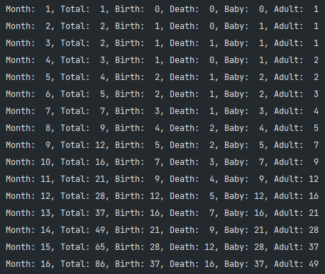
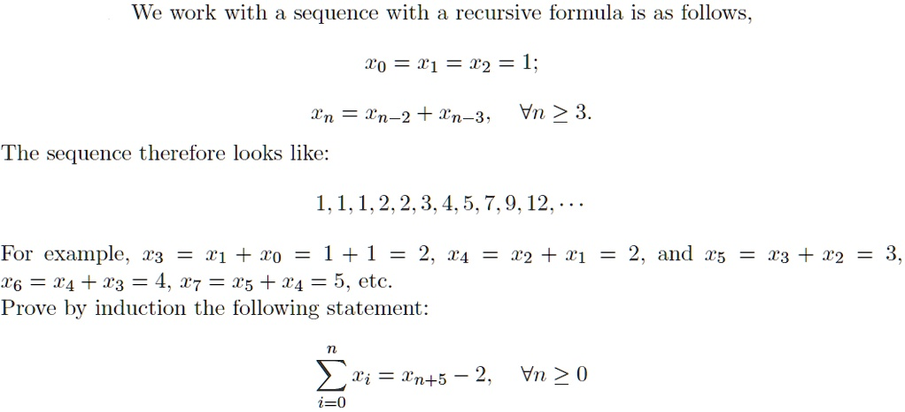

# Problems

|ID|題目名稱|是否已解|備註|
|:-:|:-:|:-:|:-:|
|1|[雜訊](#雜訊)|O|2023/03/15|
|2|[防錯](#防錯)|?|範例正常 提交WA|
|3|[停車費](#停車費)|O|2023/03/15|
|4|[存貨管理](#存貨管理)|O|2023/03/15|
|5|[拿沙包](#拿沙包)|O|2023/03/22|
|6|[耕種](#耕種)|X|待解|
|7|[千千萬萬個我!](#千千萬萬個我)|O|2023/03/16|

## [雜訊](./exercise_1_230315/src/Main.java)

### 問題描述

>埃曼使用大耳朵電波望遠鏡去嘗試接收來自地外的電磁波，希望藉此發現外星文明。
電波接收後，電腦會依電波不同將其轉換成字元，假設埃曼現在研究的方式是將電波
重複的訊號當作是來自自然界的雜訊，需要將其刪除，只保留不重複的，從中分析有規律的
信號，請您寫一個程式計算接收到的訊號資料中，不重複的字元個數（大小寫視為不同）與
刪除重複字元後的字元個數。

#### 輸入說明

>第一行有一個正整數 N ，表示共有 N 筆測試資料。接下來有 N 行，每行為一筆
測試資料，內含不超過 80 個字元的字串（含空格，不含換行記號，空格不會在字串最
後）。

#### 輸出說明

>每筆測試資料輸出兩個整數，第一個為原來字串的長度，第二個為刪除重複字元後的
長度，兩數間空一格，每筆測試資料結果輸出於一行。

#### 解題思路

透過`ArrayList`內建的`contains`method確定是否已經存在該字元，沒有則存入，有則略過。

## [防錯](./exercise_2_230315/src/Main.java)

### 問題描述

>曉華想分析接收到的電報，電報前會有一些 X 與 Y，當所有 X 與 Y 都能配對成
『XY』，表示後面傳的訊息才是正確的，請寫一支程式，判斷電報是否是正確的。

#### 輸入說明

>第一行有一個正整數 N ，表示共有 N 筆測試資料。
接下來有 N 行，每行為一筆測試資料，只含 X 與 Y 且不超過 100 個字元的字串。

#### 輸出說明

>若電報為真，輸出 Yes；反之，輸出 No。

#### 解題思路

## [停車費](./exercise_3_230315/src/Main.java)

### 問題描述

>小嫻到井三百貨買衣服，百貨的停車費是不超過 1500 秒的話都是以 70 塊計費，
超過 1500 秒後每 500 秒加 5 塊錢，不滿 500 秒的話還是以 500 秒來計費。

#### 輸入說明

>第一行有一個正整數 N ，表示共有 N 筆測試資料。接下來有 N 行，每行為一正
整數 M(500 ≤ M ≤ 10,000)，表示停放的秒數。

#### 輸出說明

>輸出停車費用。

#### 解題思路

數學問題。

## [存貨管理](./exercise_4_230315/src/Main.java)

### 問題描述

>家媛想做網拍，因為怕資金被存貨壓垮，所以想要有個存貨管理系統，如下表是他目
前的存貨狀況，請幫忙撰寫一程式可以讓家媛方便查看貨品狀況，功能為：
>
>1. 先輸入想搜尋的欄位，1 表示使用品號搜尋，2 表示使用商品名稱搜尋
>2. 接著輸入關鍵字搜尋，去查看貨品狀況。
>3. 輸入 0 表示離開。

|品號|商品名稱|庫存|
|:-|:-:|:-|
|123|iPhone_13|12|
|456|iPad|5|
|789|AirPods_Pro|14|
|321|iPhone_14|0|
|654|Apple_Watch|6|

#### 輸入說明

>輸入兩個參數，第 1 個參數代表想搜尋的欄位，1 表示使用品號搜尋，2 表示使用商
品名稱搜尋第幾個欄位。
第二個參數代表關鍵字。
0 表示結束。

#### 輸出說明

>把找到的那個商品依序印出品號、商品名稱、庫存，中間有一個空白。
如果沒有此商品，輸出 404。

#### 解題思路

自製class。

## [拿沙包](./exercise_5_230315/src/Main.java)

### 問題描述

>現在袋子裡有 n 個沙包，每次可以拿出 1 個或 2 個，請問將袋子中的沙包全部拿出
來共有幾種拿法？

#### 輸入說明

>第一行有一個正整數 N ，表示共有 N 筆測試資料。接下來有 N 行，每行為一正
整數 n 表示袋子裡有 n 個沙包(3 ≦ n ≦ 20) 。

#### 輸出說明

>輸出將袋子中沙包全部拿出來共有幾種拿法的總數。

#### 解題思路

假設袋子裡有 n 個沙包，為了將袋子中的沙包全部拿出來，可以列出以下的情況：

- 當 n = 0 時，表示已經拿完了，所以只有一種拿法。
- 當 n = 1 時，只能拿一個沙包，所以只有一種拿法。
- 當 n = 2 時，可以拿兩個沙包或拿兩次一個沙包，所以有兩種拿法。
- 當 n > 2 時，每次可以選擇拿一個沙包或拿兩個沙包，因此拿法總數為前一次拿一個沙包的拿法數加上前一次拿兩個沙包的拿法數，即：
- f(n) = f(n-1) + f(n-2)  
這是一個經典的斐波那契數列，因此將袋子中的沙包全部拿出來共有 f(n) 種拿法，其中 f(n) 表示第 n 個斐波那契數。可以使用遞迴或動態規劃等方法求解。

## [耕種](./exercise_6_230315/src/Main.java)

### 問題描述

>阿仲想在整理一空地來做耕種使用？但耕種必須在平坦的空地，否則就必須要先整理
場地。假設空地為一個 M × N 的矩形，分別用整數 0、1、2，分別代表空地的情形。
>
>- 數字 0 代表該空地非常平坦可直接耕種，並且每個單位整理需要 5 元。
>- 數字 1 代表該空地經過整理過後即可使用，並且每個單位整理需要 10 元。
>- 數字 2 代表該方格的空地是無法清理的障礙物，不可使用。  
>假設阿仲只想讓自己的耕地為正方形。且預算只有 P 元。請問在這塊空地上，符合預
算內，能夠作為耕地的最大面積單位為何?

#### 輸入說明

>第一行有一個正整數 S ，表示共有 S 筆測試資料。
每筆測資的第一行為三個正整數 M ,N(1 < M,N < 100) 以及 P(0 < P < 10000) ，
代表該空地為 M × N 的矩形以及阿仲預算為 P 塊錢。
接下來有 M 行，每行有 N 個數字 ( 數字為 0~2 之間的整數，兩個數字間有一個
空格符號 ) ，分別代表地形狀況。

#### 輸出說明

>輸出符合預算內，能夠作為耕地的最大面積單位為何。

#### 解題思路

- 暴力枚舉
- 動態規劃

## [千千萬萬個我!](./exercise_7_230315/src/Main.java)

### 問題描述

>假設現有一品種的變形蟲，牠在幼體經過一個月即可長成完成體，接著每個月牠
都會在尾部分裂 1 個新的變形蟲幼體，但新的變形蟲幼體也是需要經過 1 個月生長成
完成體，然而這種變形蟲在長成完成體之後只能存活 2 個月。
例如你一開始有一隻變形蟲 A 幼體，那麼第 1 個月你則擁有一隻變形蟲 A 完成
體；第 2 個月時此變形蟲 A 變成了 1 個月大的變形蟲 A 並產生了 1 隻新的變形蟲 B 幼
體，所以你擁有 1 隻變形蟲 B 幼體與 1 隻 1 個月大的變形蟲 A 完成體；第 3 個月時變
形蟲 B 幼體長成了完成體，而兩個月大的變形蟲 A 產生變形蟲 C 幼體後即死亡，所以
在第 3 個月時你擁有一隻變形蟲 C 幼體與一顆變形蟲 B 完成體。現在在第 0 個月給了
你一隻變形蟲幼體，請計算出在第 k 個月時你擁有幾隻變形蟲幼體。

#### 輸入說明

>測資的為一個正整數 k ， 0 < k < 120 。

#### 輸出說明

>輸出在第 k 個月時你擁有幾隻變形蟲幼體?

#### 解題思路

- [模擬程式碼](./exercise_7_230315_sim/src/Main.java)

- 解析

由模擬後的圖片可以知道，`baby`, `adult`, `birth`, `total`都與一個數列有關係， `1, 1, 1, 2, 2, 3, 4, 5, 7, 9, 12...`。
數列的關係為 
可得知第n項(n≧3)的值為第n-3項和第n-2項的值相加而來的，故我們可以使用遞迴(Recursive)來算出題目需要的值。
[圖片來源](https://www.numerade.com/ask/question/we-work-with-sequence-with-a-recursive-formula-is-as-follows-x0-1-2-l-en-tn-2-n-3-vn-2-3-the-sequence-therefore-looks-like-111223457912-for-example-13-31-0-1-1-2-24-6-243-4-7-85-24-5-etc-pro-66856/)
